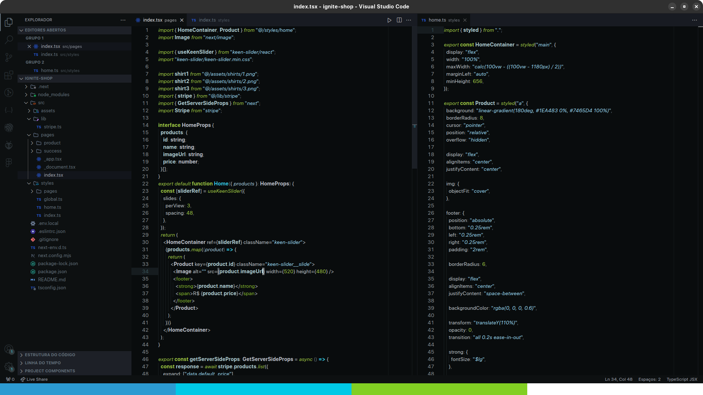

    

  <!-- version -->
  

  <!-- downloads -->
  

  <!-- rating -->
  

## :camera: Preview

  

## :hammer: Installation
1. Open the **Extensions** sidebar in VS Code
2. Search for `Roteki Theme`
3. Click **Install**
4. Open the **Command Palette** with `Ctrl+Shift+P` or `⌘+Shift+P`
5. Select **Preferences: Color Theme** and choose a Roteki Theme.
6. Enjoy! 🎉 

## :sparkles: My favorite extensions
Some extensions I use, besides (of course) the great native extensions of vscode :sweat_smile:

- [Codeium](https://marketplace.visualstudio.com/items?itemName=Codeium.codeium)
- [Auto Rename Tag](https://marketplace.visualstudio.com/items?itemName=formulahendry.auto-rename-tag)
- [Code Spell Checker](https://marketplace.visualstudio.com/items?itemName=streetsidesoftware.code-spell-checker)
- [CodeSnap](https://marketplace.visualstudio.com/items?itemName=adpyke.codesnap)
- [Symbols](https://marketplace.visualstudio.com/items?itemName=miguelsolorio.symbols)
- [GitLens](https://marketplace.visualstudio.com/items?itemName=eamodio.gitlens)

### :page_facing_up: License

[MIT](LICENSE) © [Marco Aurélio](https://github.com/omarcoaur3lio)
